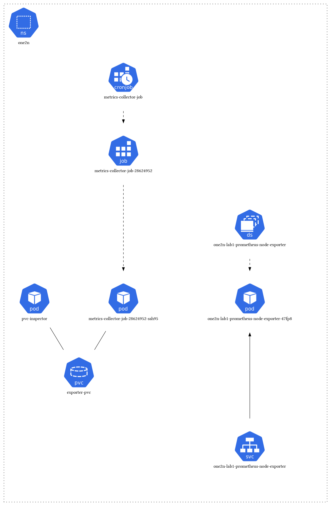

# Assessment
### My environment:
```
host = macbook
docker = Docker Desktop
Kubernetes = Docker Desktop extension
```

## Problem statement
```
Create a Kubernetes cron job that pulls node metrics like (CPU, Memory, Disk usage) and stores them in a file.

Every time the cron runs, it should create a new file. The filename should have the current timestamp.
By default, cron should be minute, but it should be configurable with the slightest changes to code.
Choose a tool of your choice to collect and expose metrics. Preferable is node exporter.
The instances involved here are Kubernetes nodes themselves.
Expected Output:

The actual program code pulls the metrics and writes them to a file.
The Dockerfile to containerize the code.
Kubernetes YAML or HELM Chart.
A README file explaining the design, deployment and other details.
If possible, record a short video to demo the output with the code files.
Note :

Pick the choice of your language to write the cron job. Preferable is bash.
Treat the output files generated as essential and should be retained on pod restarts.
Deployment can either be Kube yamls, helm charts, kustomize.
You can make necessary assumptions if required and document them.
Choose local kubernetes setup like minikube, kind. Other option is to pick any cloud platform's kubernetes flavour.
```

## Steps
There are 3 major tasks in this assignment.
1. Use a node-exporter to get the node metrics (CPU, Mem, Disk-usage)
2. Run a kubernetes cronjob every min to read the metrics
3. Read metrics and write them to a file, append the filename with datetime stamp

### Part 1
We will use the `prometheus-node-exporter` package provided by `prometheus-community` and install it via helm.
I already have the prometheus-community added to my local, just in case if you want to add it, use below cmd:
`helm repo add prometheus-community https://prometheus-community.github.io/helm-charts`

  ```
  helm repo list
  NAME                    URL                                               
  prometheus-community    https://prometheus-community.github.io/helm-charts
  ingress-nginx           https://kubernetes.github.io/ingress-nginx
  ```

We can look at the `node-exporter` chart provided by `promethues`
  ```
  helm search repo node-exporter
  NAME                                            CHART VERSION   APP VERSION     DESCRIPTION                              
  prometheus-community/prometheus-node-exporter   4.34.0          1.8.0           A Helm chart for prometheus node-exporter
  ```

We will deploy `node-exporter` using helm which will scrape the required metrics.

For the purpose of this assignment and tracking the code, let's templatize the helm chart to maintain the source of truth
  ```
  helm template one2n-lab1 prometheus-node-exporter \
  --repo https://prometheus-community.github.io/helm-charts \
  --namespace one2n \
  > one2n_node_exporter.yaml
  ```

Before creating the objects, lets update the `Service` section to use `serviceType: LoadBalancer` to be able to access it from browser
  ```
  kubectl apply -f one2n_node_exporter.yaml
  ```

We can see, following objects are created:
  ```
  kubectl get all -n one2n                 
  NAME                                            READY   STATUS    RESTARTS   AGE
  pod/one2n-lab1-prometheus-node-exporter-47fp8   1/1     Running   0          3m19s
  
  NAME                                          TYPE           CLUSTER-IP     EXTERNAL-IP   PORT(S)          AGE
  service/one2n-lab1-prometheus-node-exporter   LoadBalancer   10.106.51.83   localhost     9100:30612/TCP   3m19s
  
  NAME                                                 DESIRED   CURRENT   READY   UP-TO-DATE   AVAILABLE   NODE SELECTOR            AGE
  daemonset.apps/one2n-lab1-prometheus-node-exporter   1         1         1       1            1           kubernetes.io/os=linux   3m19s
  ```

### Part 2
Now that the node exporter is scraping the metrics,
  1. we need to run a kubernetes cronjob that will read the metrics (CPU, Memory, Disk Usage).
  2. append it to a file with date&time stamp in the filename
  3. Also running a pvc-investigator vm to be able to attach the PV and read the data

To achieve above tasks, we can build a custom docker image `scraper_app` using the `Dockerfile` that will read the simple `app.sh` code.

1. To build the docker image run below cmd from the repo
  ```
  docker build -t scraper_app:latest .
  ```
  Alternatively, we can also use the same image that has been pushed to the dockerhub at `ajinkyapwadekar/scraper_app:latest`

2. For the kubernetes cronjob, we will spun a container based on `scraper_app:latest`, to create the `cronjob,pvc and pvc-inspector pod` run:
  ```
  kubectl create -f one2n_cron_pvc_pod.yaml
  ```

  
  > used https://github.com/mkimuram/k8sviz to generate the architecture diagram.

After the objects are created, below is the output:
```
kubectl get all -n one2n -l app.kubernetes.io/instance=one2n-lab1     
NAME                                            READY   STATUS    RESTARTS   AGE
pod/one2n-lab1-prometheus-node-exporter-47fp8   1/1     Running   0          28h
pod/pvc-inspector                               1/1     Running   0          49m

NAME                                          TYPE           CLUSTER-IP     EXTERNAL-IP   PORT(S)          AGE
service/one2n-lab1-prometheus-node-exporter   LoadBalancer   10.106.51.83   localhost     9100:30612/TCP   28h

NAME                                                 DESIRED   CURRENT   READY   UP-TO-DATE   AVAILABLE   NODE SELECTOR            AGE
daemonset.apps/one2n-lab1-prometheus-node-exporter   1         1         1       1            1           kubernetes.io/os=linux   28h

NAME                                  SCHEDULE    SUSPEND   ACTIVE   LAST SCHEDULE   AGE
cronjob.batch/metrics-collector-job   * * * * *   False     0        43s             49m
```

we can also check if the `pvc-inspector` pod is able to see the files:
```
kubectl -n one2n exec -it pvc-inspector -- sh                    
/ # ls
bin            etc            home           lib64          root           tmp            var
dev            exporter-logs  lib            proc           sys            usr

ls -lrth exporter-logs/
total 192K   
-rw-r--r--    1 root     root        4.8K Jun  4 10:32 metrics_file_20240604_103201.log
-rw-r--r--    1 root     root        4.8K Jun  4 10:33 metrics_file_20240604_103300.log
-rw-r--r--    1 root     root        4.8K Jun  4 10:34 metrics_file_20240604_103400.log
-rw-r--r--    1 root     root        4.8K Jun  4 10:35 metrics_file_20240604_103501.log
-rw-r--r--    1 root     root        4.8K Jun  4 10:36 metrics_file_20240604_103600.log
-rw-r--r--    1 root     root        4.8K Jun  4 10:37 metrics_file_20240604_103700.log
-rw-r--r--    1 root     root        4.8K Jun  4 10:38 metrics_file_20240604_103800.log
-rw-r--r--    1 root     root        4.8K Jun  4 10:39 metrics_file_20240604_103900.log
-rw-r--r--    1 root     root        4.8K Jun  4 11:09 metrics_file_20240604_110918.log
-rw-r--r--    1 root     root        4.8K Jun  4 11:10 metrics_file_20240604_111000.log
-rw-r--r--    1 root     root        4.8K Jun  4 11:11 metrics_file_20240604_111100.log
-rw-r--r--    1 root     root        4.8K Jun  4 11:12 metrics_file_20240604_111200.log
-rw-r--r--    1 root     root        4.8K Jun  4 11:13 metrics_file_20240604_111300.log
-rw-r--r--    1 root     root        4.8K Jun  4 11:14 metrics_file_20240604_111400.log
-rw-r--r--    1 root     root        4.8K Jun  4 11:15 metrics_file_20240604_111500.log
-rw-r--r--    1 root     root        4.8K Jun  4 11:16 metrics_file_20240604_111600.log
-rw-r--r--    1 root     root        4.8K Jun  4 11:17 metrics_file_20240604_111700.log
-rw-r--r--    1 root     root        4.8K Jun  4 11:18 metrics_file_20240604_111800.log
-rw-r--r--    1 root     root        4.8K Jun  4 11:19 metrics_file_20240604_111900.log
-rw-r--r--    1 root     root        4.8K Jun  4 11:20 metrics_file_20240604_112000.log
-rw-r--r--    1 root     root        4.8K Jun  4 11:21 metrics_file_20240604_112100.log
-rw-r--r--    1 root     root        4.8K Jun  4 11:22 metrics_file_20240604_112200.log
-rw-r--r--    1 root     root        4.8K Jun  4 11:23 metrics_file_20240604_112301.log
-rw-r--r--    1 root     root        4.8K Jun  4 11:24 metrics_file_20240604_112400.log
```

